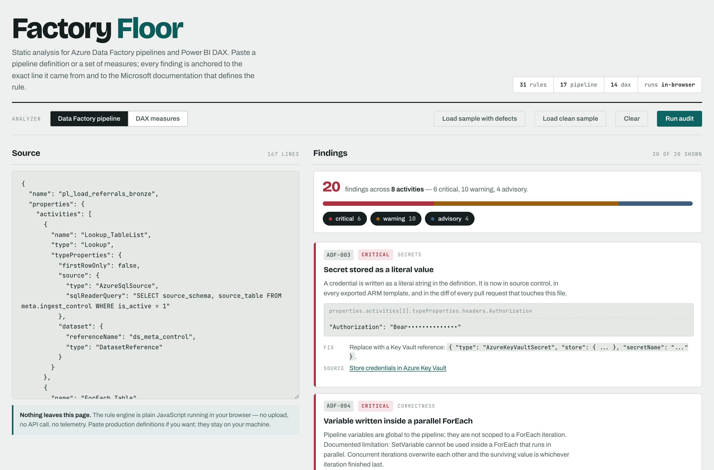

# Factory Floor



A browser-based static analyzer for **Azure Data Factory pipeline JSON** and **Power BI DAX measures**.

Paste a pipeline definition or a measure, and Factory Floor reports the defects it finds — each one
tied to a rule ID, a severity, and a link to the Microsoft documentation that backs it.

**Live:** https://zionccit-dotcom.github.io/factory-floor/

---

## What it does

Factory Floor runs **31 rules** across two analyzers:

- **17 Data Factory rules** (`ADF-001` … `ADF-017`) — parse a pipeline's activity graph and check it
  for resilience gaps, hard-coded secrets, ForEach concurrency hazards, broken `dependsOn` references,
  and governance omissions.
- **14 DAX rules** (`DAX-001` … `DAX-014`) — read a measure expression and check it for correctness
  traps, avoidable storage-engine work, and patterns that a newer DAX function supersedes.

Findings are graded **critical**, **warning**, or **advisory**, and grouped by category
(correctness, performance, secrets, resilience, structure, concurrency, portability, clarity,
robustness, governance).

---

## How it works

- **A deterministic rule set, not a model.** Each rule is hand-written logic that walks the
  parsed structure and fires on conditions decidable from that structure alone. The same input
  always produces the same findings — nothing is sampled, ranked, or inferred.
- **Every rule cites Microsoft documentation.** A finding links to the Microsoft Learn page that
  documents the behaviour it is based on, so you can check the rule rather than take its word.
- **One self-contained HTML file.** No build step, no dependencies, no backend. The analysis runs
  in your browser and your pipeline definitions never leave it — the only request the page makes
  is for a web font stylesheet.

---

## The rules

### Data Factory — 17 rules

| ID | Severity | Category | Rule |
|----|----------|----------|------|
| ADF-001 | warning | resilience | Activity has no retry policy |
| ADF-002 | warning | resilience | Activity has no timeout override |
| ADF-003 | critical | secrets | Secret stored as a literal value |
| ADF-004 | critical | correctness | Variable written inside a parallel ForEach |
| ADF-005 | critical | correctness | ForEach batchCount above the documented maximum |
| ADF-006 | advisory | concurrency | Parallel ForEach with no batchCount |
| ADF-007 | critical | correctness | ForEach nested inside another ForEach |
| ADF-008 | warning | correctness | Lookup returns all rows — silent truncation at 5,000 |
| ADF-009 | warning | resilience | Pipeline has no failure path |
| ADF-010 | warning | secrets | Activity handling credentials is not marked secure |
| ADF-011 | critical | structure | `dependsOn` names an activity that does not exist |
| ADF-012 | critical | structure | Duplicate activity name |
| ADF-013 | advisory | structure | Activity has no dependency and starts immediately |
| ADF-014 | advisory | portability | Hard-coded date literal |
| ADF-015 | warning | secrets | SQL text assembled by string concatenation |
| ADF-016 | advisory | governance | Pipeline has no folder or annotations (factory-scale only) |
| ADF-017 | critical | correctness | `Completed` dependency masks upstream failure |

### DAX — 14 rules

| ID | Severity | Category | Rule |
|----|----------|----------|------|
| DAX-001 | warning | correctness | Division by an expression without `DIVIDE` |
| DAX-002 | warning | performance | `IFERROR` or `ISERROR` masks the defect |
| DAX-003 | advisory | performance | `COUNT` on a column where rows are the intent |
| DAX-004 | advisory | clarity | `HASONEVALUE` + `VALUES` pattern |
| DAX-005 | warning | robustness | Measure reference is fully qualified |
| DAX-006 | warning | performance | `FILTER` used where a boolean predicate works |
| DAX-007 | warning | performance | Sub-expression evaluated twice, no `VAR` |
| DAX-008 | advisory | clarity | `EARLIER` used instead of a variable |
| DAX-009 | warning | performance | `COUNTROWS(FILTER(...))` instead of `CALCULATE` |
| DAX-010 | advisory | correctness | Measure returns text from `FORMAT` |
| DAX-011 | advisory | portability | Hard-coded date in a filter |
| DAX-012 | advisory | clarity | `CALCULATE` nested three deep |
| DAX-013 | advisory | performance | `DISTINCTCOUNT` on a fact column |
| DAX-014 | advisory | clarity | `ALL` used as a filter modifier |

### Auditing a whole factory

Most rules are decidable from a single pipeline. A few are not: **ADF-016** asks whether a pipeline
can still be found among its neighbours, which is meaningless without knowing how many neighbours
there are. Rather than guess, the analyzer takes the whole factory when you have it. Three input
shapes are accepted:

| Input | Factory size |
|-------|--------------|
| One pipeline object | unknown |
| An array of pipeline objects | array length |
| An exported ARM template (`resources[]`) | count of `factories/pipelines` resources |

With an array or ARM template, findings are labelled by pipeline (`PL_Gold › activities[0].policy …`)
and ARM's `[concat(parameters('factoryName'), '/PL_Gold')]` names are resolved back to `PL_Gold`.

**ADF-016 fires only when the factory is known to hold more than 10 pipelines.** Given one pipeline
the size is unknown, so it stays silent instead of reporting a governance gap it cannot actually
observe. A rule that cannot test its own precondition should not fire on the assumption that it
holds.

### Suppressing a finding

A rule can be right in general and wrong for one activity. An activity opts out of a rule with a
`userProperties` entry — ADF-native, so it survives a Studio round-trip and shows in monitoring:

```json
"userProperties": [
  {
    "name": "factory-floor-ignore",
    "value": "ADF-017: wake-up is best-effort; the copy fails on its own if the database is down"
  }
]
```

The value is a comma-separated list of rule IDs, optionally followed by `: reason`. The opt-out
applies only to findings on that activity.

**Suppressed findings are not discarded.** They are returned separately and counted in the results
header, so an opt-out stays auditable instead of quietly shrinking the report.

Every finding links out to the Microsoft Learn page that documents the underlying behaviour —
ForEach concurrency limits, the Lookup activity's 5,000-row ceiling, Key Vault–backed linked
services, `DIVIDE` semantics, filter-argument evaluation in `CALCULATE`, and so on.

---

## The engine is deterministic, not model-based

There is no language model in this tool, and no inference of any kind.

Each rule is hand-written logic that walks a parsed structure — the pipeline's activity graph for
Data Factory, a tokenized expression for DAX — and fires on conditions that are decidable from that
structure alone. The same input always produces the same findings, in the same order, with the same
severities. Nothing is sampled, ranked, or guessed.

That is a deliberate design choice. A static analyzer whose output changes between runs cannot be
put in a code review or a CI gate, and a finding a reviewer cannot trace back to a documented rule
is a finding they cannot act on. Every result here traces to one rule and one citation.

---

## It runs entirely client-side

Factory Floor is a single self-contained HTML file. All 30 rules execute in your browser, in
JavaScript, on the page you already have open.

**Pipeline definitions and measures never leave the browser.** There is no backend, no API call, no
telemetry, and no storage. Nothing is uploaded, logged, or retained — the analysis happens locally
and disappears when you close the tab. The only network request the page makes is for a Google Fonts
stylesheet.

This matters for the intended use: Data Factory pipeline JSON routinely carries server names,
database names, container paths, and — when someone has made the mistake `ADF-003` looks for —
live credentials. None of that is safe to paste into a hosted service, so this one isn't hosted.

---

## Running it

Open the live URL above, or clone and open `index.html` directly:

```
git clone https://github.com/zionccit-dotcom/factory-floor.git
open factory-floor/index.html
```

No build step, no dependencies, no install.
